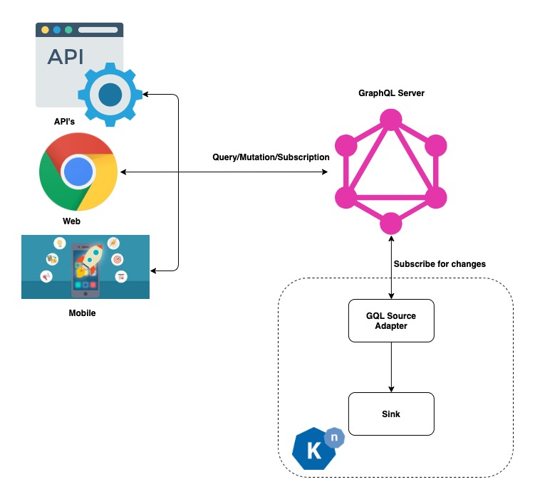
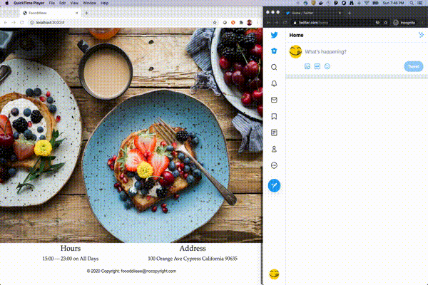

# Knative Eventing source for GraphQL Subscription

GraphQL Source is a kubernetes resource specifying the GraphQL endpoint and subscription 
queries. It is backed by a controller. On creation of this resource a reciever adapter is 
created which subscribes to the graph ql endpoint with queries specified.

Ideal for tracking incremental changes of an entity. Checkout the example to see how GQL Source 
can be put to work.



### Installation

```
ko apply -Rf config/
```

### Example

[Restaurant Example](./examples/restaurant-app)




