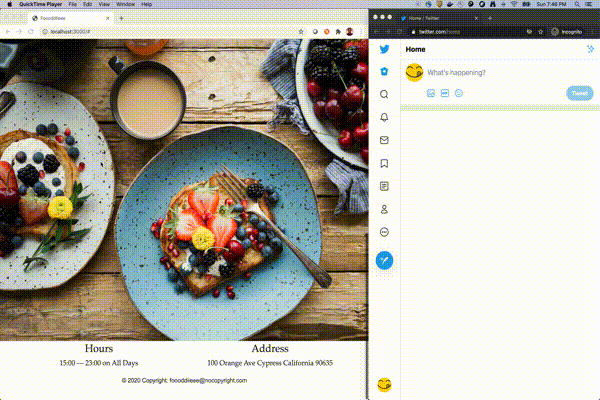

# Restaurant App

### About the usecase

Simple restaurant app, which has a web page to display the menu, location and hours. 
The details are fed from a graphql endpoint. 

The GqlSource subscribes to this endpoint and tracks the changes on menu and other info.
When there is a change, the GqlSource's receiver adapter calls 'smbot' knative service 
to act upon it. 

The smbot tweets the updates.



### Run the examples

#### Prereq

1. Twitter API access - get access to twitter api and create secrets as below.
This is for tweeting out the changes

```
kubectl create secret generic twitter --from-literal CONSUMER_KEY= --from-literal CONSUMER_SECRET= --from-literal ACCESS_TOKEN= --from-literal ACCESS_SECRET=
``` 

```
kubectl apply -f release/release.yaml
```

### Web App

```
cd web/foooddiieee

# change the graphql url in index.js

npm install

npm start
```

#### Web Template Credits

- [YaninaTrekhleb](https://github.com/YaninaTrekhleb/restaurant-website)
